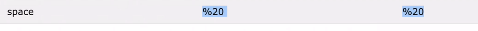

# Cont.


Before we get started with the project , spin the MONGO server in HYPER TERMINAL - "mongod" and then open the ROBO 3T to connect and get started.


```text
To create chainable routes << app.route() >>
```


### 🐞 GET a SPECIFIC ARTICLE

#### 👉 Get




#### 👉 put &lt;&lt;update the whole doc&gt;&gt;


{overwrite : true} --&gt; It updates the entire document ,if its marked as false ,then it updates only the particular change.


If only content has to be changed , it does not else it will change all .


### What if,only one has to be changed!?


### 👉 Patch a specific article &lt;&lt;focus only on the replaceable part&gt;


#### $set indicates only to update the required


#### After send


### 👉 Delete a specific article / doc


#### Before


#### after


#### After pressing Send


>


```text
THE END
```

